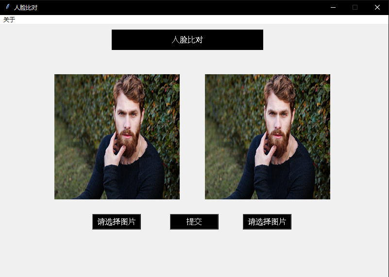
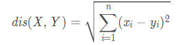
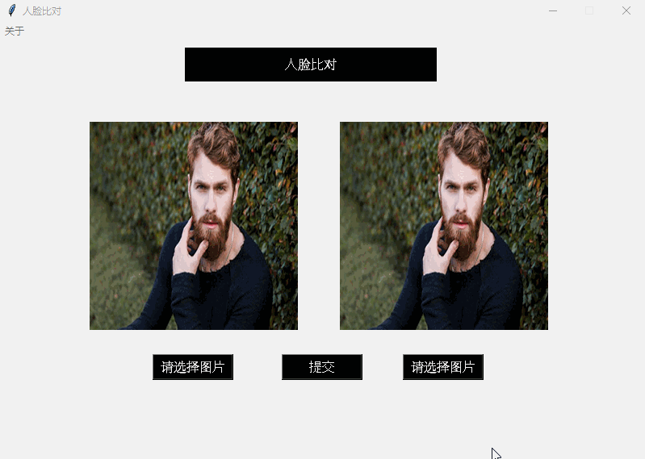

# python-tkinter系列最终弹之人脸比对

python -使用tkinter编写的人脸比对小工具，face compare, tkinter, face_recognition

 


## Requirements

* Python3
* PIL
* uuid
* face_recognition
* cv2


## 主界面




`init_window`部分是程序的`UI`设计部分，然后就是实现图中三个按钮的点击事件，其中“请选择图片”的两个按钮功能一样，都是点击选择文件，并加载到页面上，替换掉首页的图片。

提交按钮实现的就是两张人脸图片比对的逻辑了:

有一个需要注意的地方是：`opencv`不能加载带中文图片路径，所以程序中用`PIL`的`Image.open()`加载图片，并使用`Image.save()`重新保存一份到自己定义的文件夹，然后还定义了一个`resize_img()`函数，对过大的图片进行等比例缩放，并保存下来，提高运算的效率。

人脸比对使用了最简单的人脸识别库：`face_recogniton`，首先通过`face_recognition.load_image_file()`加载图片，毕竟用了别人的库，就得按照人家的方式进行加载。

然后通过`face_recognition.face_encodings()`提取人脸的特征，提取出来的是一个128维的向量，最后使用`face_recognition.face_distance()`计算两个128向量的欧式距离，计算方式如下



当然这里就不用自己计算了，`face_distance()`已经帮你实现好了。

人脸比对还有很多其他的方法，比如`facenet`，`arcface`。这里框架已经搭好了，剩下的你们可以根据需要去替换自己的算法。

好了，我们来运行一下吧。

```
python main.py
```



